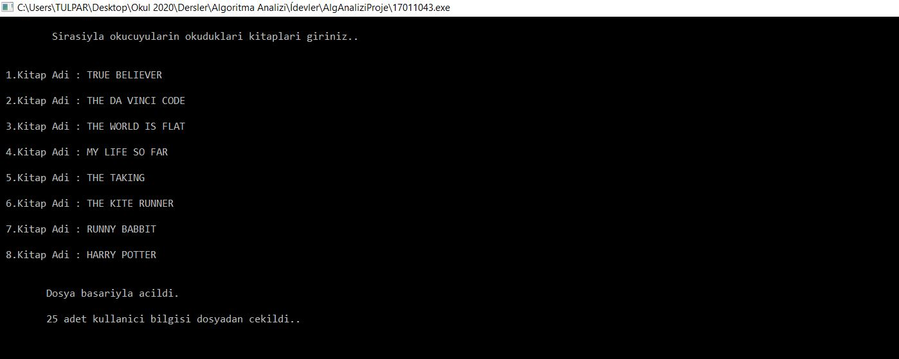
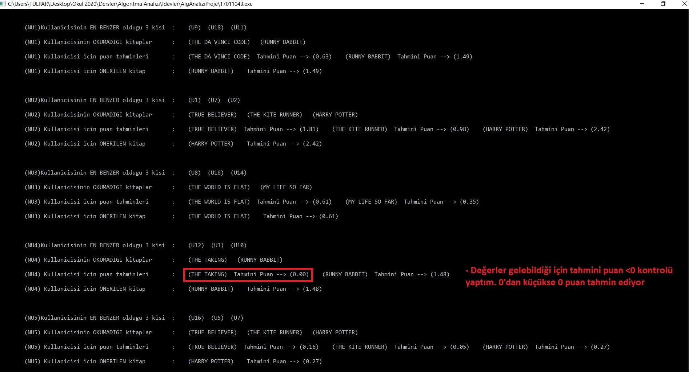

# Book Suggestion System

> **Analysis of Algorithm, Term Project (3rd year of University)**

# Assignment

Today, many companies with millions of users on the internet such as **Youtube, Netflix, Amazon, Pinterest** offer personalized recommendations to users with **machine learning-based** recommendation systems.

In this study, a system that recommends a new book by looking at a person's previous choices with the **collaborative filtering** method will be designed and implemented.

Check detailed assignment [description](https://github.com/uguraltindal/Book-Suggestion-System/blob/main/BLM3021TermProject.pdf).

## Getting Ready

Please make sure that the **puanlar.txt** file in the rar is in the same location as the .c extension code in order not to enter the values one by one while you are trying.

> Entering the books that the readers have read in order. (This section is symbolic. You can enter the values you want in the book names.                            
> **Ex : Harry Potter, Attack on Titan, Lord of the Rings)**

## Results

Appropriate books were suggested to the user and displayed. You can check my final report [here](https://github.com/uguraltindal/Book-Suggestion-System/blob/main/17011043.pdf). Code is [here](https://github.com/uguraltindal/Book-Suggestion-System/blob/main/bookrecommendation.c)

